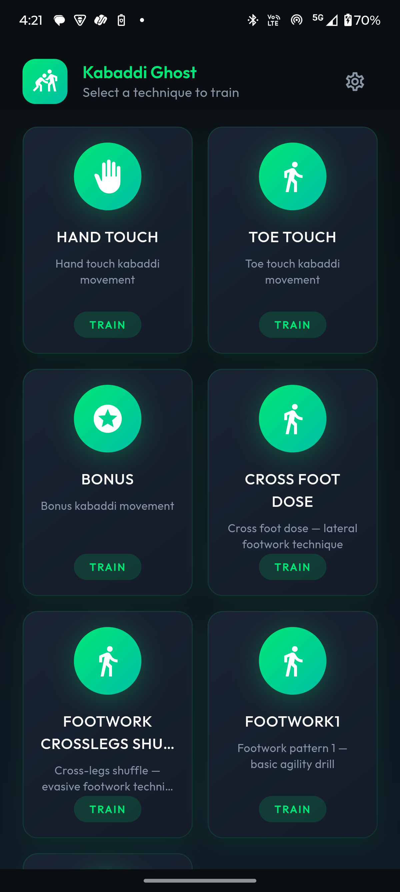
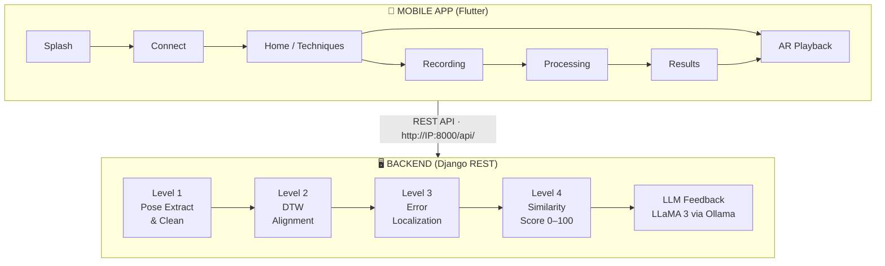
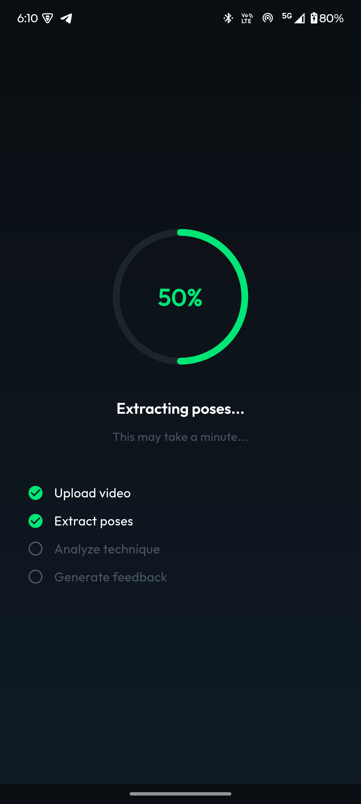
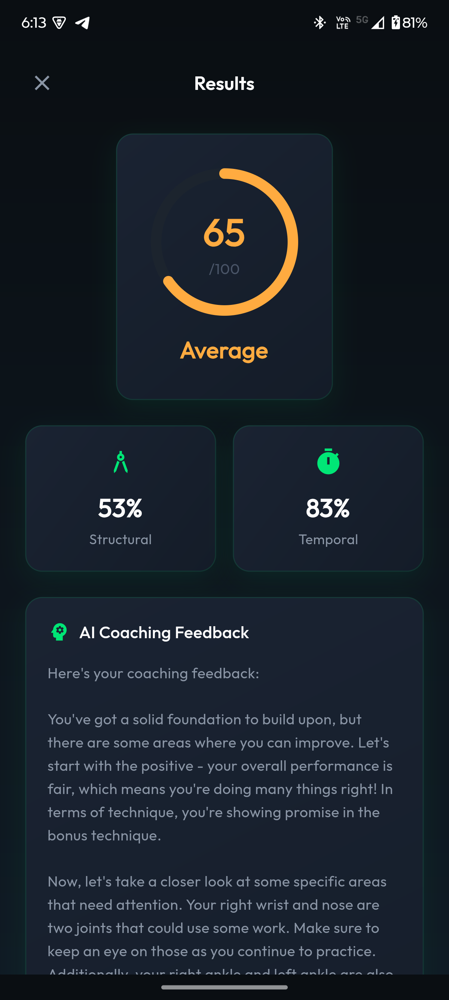
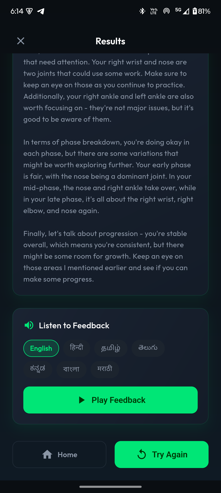
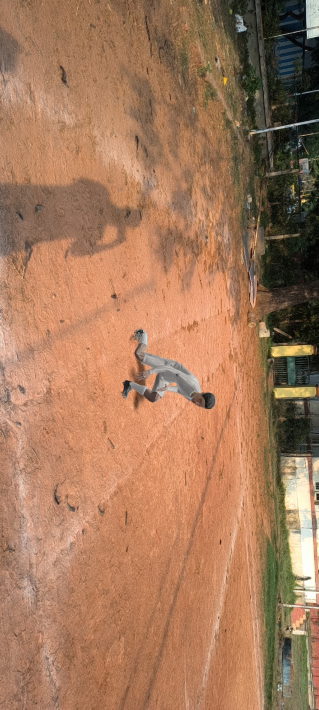
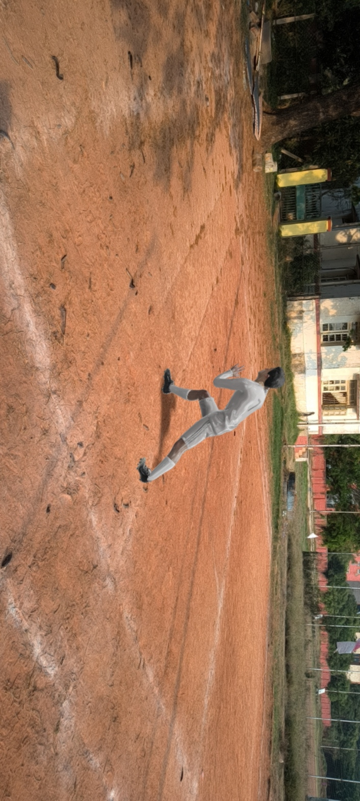
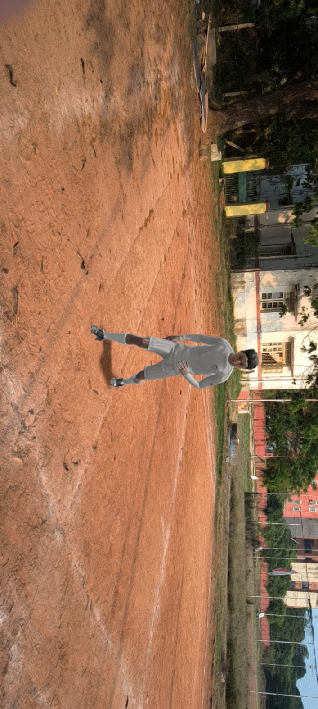

<p align="center">
  
</p>

<h1 align="center">🏏 Kabaddi 360</h1>

<p align="center">
  <b>An AR-Based Coaching System for Kabaddi Using Pose Estimation and LLM Feedback</b>
</p>

<p align="center">
  
  
  
  
  
  
</p>

---

## 📋 Overview

**Kabaddi 360** is a mobile coaching system that uses **Augmented Reality ghost overlays**, **computer vision pose estimation**, and **LLM-powered feedback** to help Kabaddi players improve their technique.

A player records themselves performing a move (Bonus, Hand Touch, Toe Touch, etc.), and the system:
1. Extracts and cleans their 2D pose skeleton  
2. Aligns it temporally with an expert reference using Dynamic Time Warping  
3. Computes joint-level error metrics across movement phases  
4. Generates a similarity score (0–100)  
5. Produces natural-language coaching feedback via LLaMA 3  
6. Delivers results with AR ghost playback and optional TTS audio  

---

## ✨ Key Features

| Feature | Description |
|---------|-------------|
| **AR Ghost Playback** | Visualize expert pose as an AR skeleton overlay on the mobile device |
| **4-Level Pose Pipeline** | Extraction → Alignment → Error Localization → Scoring |
| **YOLO + MediaPipe** | Person detection (YOLOv8) + 17-joint COCO skeleton extraction (MediaPipe) |
| **Level-1 Cleaning** | Interpolation, pelvis centering, torso-scale normalization, outlier suppression, EMA smoothing |
| **DTW Alignment** | Dynamic Time Warping for tempo-invariant comparison between user and expert |
| **Phase-Aware Errors** | Error metrics segmented into movement phases (wind-up, execution, follow-through) |
| **LLM Coaching** | LLaMA 3 generates structured, actionable coaching feedback via Ollama |
| **TTS Audio** | Text-to-speech feedback in English with on-device Tamil translation |
| **Multi-Technique** | Supports Bonus, Hand Touch, Kick, Toe Touch, Footwork, and more |

---

## 🏗️ System Architecture



---

## 📂 Project Structure

```
kabaddi_trainer/
├── kabaddi_app/              # Flutter mobile application
│   ├── lib/
│   │   ├── main.dart         # App entry point (KabaddiApp)
│   │   ├── screens/          # UI screens
│   │   │   ├── splash_screen.dart
│   │   │   ├── connect_screen.dart     # Enter backend IP
│   │   │   ├── home_screen.dart        # Technique selection
│   │   │   ├── ar_playback_screen.dart # AR ghost overlay
│   │   │   ├── recording_screen.dart   # Camera recording
│   │   │   ├── processing_screen.dart  # Status polling
│   │   │   └── results_screen.dart     # Scores + feedback display
│   │   ├── services/
│   │   │   └── api_service.dart        # Dio HTTP client
│   │   ├── providers/                  # State management (Provider)
│   │   ├── models/                     # Data models
│   │   └── theme/                      # Dark theme
│   ├── assets/               # Images and 3D models
│   └── android/              # Android build config
│
├── kabaddi_backend/          # Django REST backend
│   ├── api/
│   │   ├── models.py         # Tutorial, UserSession, RawVideo, PoseArtifact, AnalyticalResults, LLMFeedback
│   │   ├── views.py          # REST endpoints
│   │   ├── tasks.py          # 4-level pipeline orchestrator
│   │   └── urls.py           # URL routing
│   ├── kabaddi_backend/
│   │   ├── settings.py       # Django settings (paths, DB, ML config)
│   │   ├── middleware.py     # CORS middleware
│   │   ├── urls.py           # Root URL config
│   │   └── wsgi.py
│   ├── media/                # Runtime data (auto-created)
│   │   ├── expert_poses/     # Expert .npy reference files ← YOU MUST SEED THIS
│   │   ├── raw_videos/       # Uploaded user videos
│   │   ├── poses/            # Extracted user poses
│   │   ├── results/          # Pipeline output (scores, errors)
│   │   ├── animations/       # FBX animation files
│   │   └── tts_audio/        # Generated TTS .wav files
│   ├── db.sqlite3            # SQLite database
│   ├── manage.py
│   └── yolov8n.pt            # YOLOv8 model weights
│
├── level1_pose/              # Level-1 pose extraction & cleaning
│   ├── pose_extract_cli.py   # CLI: video → COCO-17 .npy
│   ├── level1_cleaning.py    # 6-stage cleaning pipeline
│   ├── mp33_to_coco17.py     # MediaPipe 33 → COCO 17 adapter
│   ├── joints.py             # Joint index constants
│   ├── pose_landmarker_heavy.task  # MediaPipe model (30 MB)
│   └── yolov8n.pt            # YOLOv8 model weights
│
├── llm_feedback/             # LLM coaching feedback module
│   ├── context_engine.py     # Pipeline metrics → structured LLM context
│   ├── prompt_builder.py     # System + instruction prompt builder
│   ├── llm_client.py         # Ollama HTTP client (localhost:11434)
│   ├── config.py             # Thresholds, LLM params (model, temp, timeout)
│   └── views.py              # Django views for feedback endpoints
│
├── pipeline/                 # 3D multi-view pose pipeline (experimental)
├── data/                     # Expert pose database & metadata
├── samples/                  # Test videos and evaluation data
├── AR_Results/               # AR screenshot evidence
├── Assets/                   # 3D character models (FBX)
├── documents/                # Project thesis (LaTeX)
├── tests/                    # Unit tests
└── _archive/                 # Archived legacy code
```

---

## 🚀 Complete Setup & Run Guide

### Prerequisites

Before starting, make sure you have the following installed:

| Dependency | Version | Purpose | Install Link |
|-----------|---------|---------|--------------|
| **Python** | 3.10+ | Backend, pose extraction, LLM | [python.org](https://www.python.org/downloads/) |
| **Flutter** | 3.x | Mobile app | [flutter.dev](https://flutter.dev/docs/get-started/install) |
| **Android SDK** | 33+ | Android build | Included with Android Studio |
| **Ollama** | Latest | Local LLM inference | [ollama.com](https://ollama.com/download) |
| **FFmpeg** | Latest | Video preprocessing | Auto-installed via `imageio-ffmpeg` |
| **Git** | Latest | Version control | [git-scm.com](https://git-scm.com/) |

> **⚠️ Python 3.10 is required** — MediaPipe and some ML packages have strict version constraints. The backend settings (`settings.py`) explicitly looks for Python 3.10.

---

### Step 1: Clone the Repository

```bash
git clone https://github.com/ibrahim-1702/Kabaddi-360-.git
cd Kabaddi-360-
```

---

### Step 2: Set Up Python Virtual Environment

```bash
# Create virtual environment with Python 3.10
python -m venv venv

# Activate (Windows)
venv\Scripts\activate

# Activate (Linux/macOS)
# source venv/bin/activate
```

---

### Step 3: Install Python Dependencies

```bash
pip install --upgrade pip

# Core Django backend
pip install django

# ML / Computer Vision
pip install numpy opencv-python mediapipe ultralytics lapx

# Signal processing & alignment
pip install scipy fastdtw

# Video processing
pip install imageio-ffmpeg

# LLM communication
pip install requests

# Text-to-Speech
pip install pyttsx3

# (Optional) For data analysis
pip install pandas matplotlib seaborn
```

> **Quick install (all at once):**
> ```bash
> pip install django numpy opencv-python mediapipe ultralytics lapx scipy fastdtw imageio-ffmpeg requests pyttsx3
> ```

---

### Step 4: Install & Configure Ollama (LLM Feedback)

Ollama runs a local LLM server that powers the AI coaching feedback.

#### 4a. Install Ollama

- **Windows:** Download from [ollama.com/download](https://ollama.com/download) and run the installer
- **Linux:** `curl -fsSL https://ollama.com/install.sh | sh`
- **macOS:** `brew install ollama`

#### 4b. Pull the LLaMA 3 Model

```bash
ollama pull llama3
```

> This downloads ~4.7 GB. You can verify it's ready with:
> ```bash
> ollama list
> ```
> You should see `llama3` in the output.

#### 4c. Start Ollama Server

```bash
ollama serve
```

> Ollama runs on `http://localhost:11434` by default.  
> Leave this terminal open — the backend connects to it during feedback generation.
>
> **Verify Ollama is running:**
> ```bash
> curl http://localhost:11434/api/tags
> ```
> You should see a JSON response listing your models.

> **💡 Note:** If you want to use a different model (e.g., `mistral`), update `LLM_MODEL` in `llm_feedback/config.py`:
> ```python
> LLM_MODEL = "mistral"  # or "llama3", "gemma", etc.
> ```

---

### Step 5: Set Up the Django Backend

```bash
cd kabaddi_backend

# Run database migrations
python manage.py migrate

# Seed the tutorials database
python manage.py shell
```

In the Django shell, create your tutorial entries:

```python
from api.models import Tutorial

# Create tutorials for each technique
# The 'name' MUST match the .npy filename in media/expert_poses/
tutorials = [
    ("hand_touch", "Defensive hand touch technique"),
    ("bonus", "Bonus kick with arm extension"),
    ("cross_foot_dose", "Cross foot dose raiding move"),
    ("footwork1", "Basic footwork drill 1"),
    ("footwork2", "Basic footwork drill 2"),
    ("footwork_crosslegs_shuffle", "Cross-leg shuffle footwork"),
]

for name, desc in tutorials:
    Tutorial.objects.get_or_create(
        name=name,
        defaults={
            'description': desc,
            'expert_pose_path': f'expert_poses/{name}.npy',
            'is_active': True
        }
    )
    print(f"Created: {name}")

exit()
```

> **Expert poses are pre-included** in `kabaddi_backend/media/expert_poses/`. If you want to add a new technique, extract the expert pose from a reference video:
> ```bash
> cd ../level1_pose
> python pose_extract_cli.py <expert_video.mp4> ../kabaddi_backend/media/expert_poses/<technique_name>.npy
> ```

---

### Step 6: Start the Backend Server

```bash
cd kabaddi_backend

# Start Django development server (accessible from network)
python manage.py runserver 0.0.0.0:8000
```

> **Important:** Use `0.0.0.0:8000` (not just `runserver`) so your phone can connect over WiFi.

**Verify the server is running:**
```bash
# Health check
curl http://localhost:8000/api/health/
# Expected: {"status": "ok", "service": "kabaddi_backend"}

# List tutorials
curl http://localhost:8000/api/tutorials/
# Expected: {"tutorials": [{"id": "...", "name": "hand_touch", ...}, ...]}
```

---

### Step 7: Build & Run the Flutter App

```bash
cd kabaddi_app

# Get Flutter dependencies
flutter pub get

# Connect Android device via USB (enable USB debugging)
# Verify device is connected:
flutter devices

# Run the app
flutter run
```

#### Connecting the App to the Backend

1. Launch the app on your Android device  
2. On the **Connect Screen**, enter the backend URL:
   ```
   http://<YOUR_COMPUTER_IP>:8000
   ```
   > Find your IP: `ipconfig` (Windows) or `ifconfig` (Linux/macOS)  
   > Example: `http://192.168.1.5:8000`

3. The app will verify the connection via the `/api/health/` endpoint  
4. Once connected, you'll see the technique selection screen

> **⚠️ Both your phone and computer must be on the same WiFi network.**

---

### Step 8: Complete Workflow Test

Once everything is running:

1. **Start Ollama** → `ollama serve` (Terminal 1)  
2. **Start Django** → `python manage.py runserver 0.0.0.0:8000` (Terminal 2)  
3. **Run Flutter app** → `flutter run` (Terminal 3)  
4. In the app:
   - Connect to backend → Select a technique (e.g., "bonus")
   - Watch the AR ghost playback of the expert pose
   - Record yourself performing the technique
   - Wait for the pipeline to process (~30–60 seconds)
   - View your scores, joint-level error breakdown, and AI coaching feedback

---

## 🔌 API Reference

Base URL: `http://<server>:8000/api/`

### Endpoints

| Method | Endpoint | Description | Request Body |
|--------|----------|-------------|-------------|
| `GET` | `/health/` | Service health check | — |
| `GET` | `/tutorials/` | List all active techniques | — |
| `GET` | `/tutorials/<uuid>/ar-poses/` | AR-ready expert pose data (COCO-17 JSON) | — |
| `GET` | `/tutorials/<uuid>/animation/` | Download FBX animation file | — |
| `POST` | `/session/start/` | Start a new training session | `{"tutorial_id": "<uuid>"}` |
| `POST` | `/session/<uuid>/upload-video/` | Upload user performance video | `multipart/form-data: video` |
| `POST` | `/session/<uuid>/assess/` | Trigger the 4-level pipeline | — |
| `GET` | `/session/<uuid>/status/` | Poll pipeline processing status | — |
| `GET` | `/session/<uuid>/results/` | Get scores, error metrics, and LLM feedback | — |
| `GET` | `/session/<uuid>/tts-audio/` | Get TTS audio feedback (WAV) | — |

### Session Lifecycle

```
POST /session/start/          → status: "created"
POST /session/<id>/upload/    → status: "video_uploaded"
POST /session/<id>/assess/    → status: "processing"
  ↓ (background pipeline runs)
GET  /session/<id>/status/    → status: "pose_extracted" → "level1_complete" → "scoring_complete" → "feedback_generated"
GET  /session/<id>/results/   → { scores, error_metrics, feedback }
```

---

## ⚙️ Pipeline Details

### Level 1 — Pose Extraction & Cleaning

| Stage | Operation | Purpose |
|-------|-----------|---------|
| 1 | Invalid Joint Detection | Flag NaN/zero joints |
| 2 | Temporal Interpolation | Fill gaps via linear interpolation |
| 3 | Pelvis Centering | Translate skeleton so pelvis = origin |
| 4 | Torso-Scale Normalization | Normalize by torso length for body-size invariance |
| 5 | Outlier Frame Suppression | Replace high-velocity spike frames (z > 3.0) |
| 6 | EMA Smoothing | Exponential moving average (α = 0.75) for jitter removal |

**Input:** Video file (MP4) → **Output:** Cleaned poses `numpy.ndarray` shape `(T, 17, 2)` in COCO-17 format

### Level 2 — Temporal Alignment
- **Algorithm:** Dynamic Time Warping (DTW) via `fastdtw` / `scipy`
- **Purpose:** Aligns user and expert sequences that differ in speed or tempo
- **Output:** Aligned expert and user pose arrays of equal length

### Level 3 — Error Localization
- **Joint-level errors** computed per frame using Euclidean distance
- **Phase segmentation** divides movement into wind-up, execution, and follow-through
- **Output:** `error_metrics.json` with per-joint, per-phase error statistics

### Level 4 — Similarity Scoring
- **0–100 overall score** computed from normalized error metrics
- Per-joint and per-phase sub-scores
- **Output:** `scores.json`

### LLM Feedback Generation
- **Context Engine** (`llm_feedback/context_engine.py`): Converts numeric metrics → structured text
- **Prompt Builder** (`llm_feedback/prompt_builder.py`): Creates coaching-oriented system + instruction prompts
- **LLM Client** (`llm_feedback/llm_client.py`): Sends prompts to Ollama (LLaMA 3) at `localhost:11434`
- **TTS Engine**: Converts feedback text to spoken audio (WAV) via `pyttsx3`
- **On-device translation**: Tamil via Google ML Kit in the Flutter app

**LLM Configuration** (`llm_feedback/config.py`):
| Parameter | Value | Description |
|-----------|-------|-------------|
| `LLM_ENDPOINT` | `http://localhost:11434/api/generate` | Ollama API URL |
| `LLM_MODEL` | `llama3` | Model name |
| `LLM_TEMPERATURE` | `0.3` | Low temp for consistent feedback |
| `LLM_MAX_TOKENS` | `1024` | Max output tokens |
| `LLM_TIMEOUT` | `180s` | Request timeout |

---

## 📱 App Screenshots

<p align="center">
  
  &nbsp;&nbsp;
  
  &nbsp;&nbsp;
  
  &nbsp;&nbsp;
  
</p>

<p align="center">
  
  &nbsp;&nbsp;
  
  &nbsp;&nbsp;
  
</p>

---

## 🧪 Supported Techniques

| Technique | Expert Pose File | Description |
|-----------|-----------------|-------------|
| **Hand Touch** | `hand_touch.npy` | Defensive hand touch on opponent |
| **Bonus** | `bonus.npy` | Bonus kick with arm extension |
| **Cross Foot Dose** | `cross_foot_dose.npy` | Cross foot dose raiding move |
| **Footwork 1** | `footwork1.npy` | Basic footwork drill |
| **Footwork 2** | `footwork2.npy` | Advanced footwork drill |
| **Cross-Leg Shuffle** | `footwork_crosslegs_shuffle.npy` | Cross-leg shuffle footwork |

---

## 🛠️ Tech Stack

| Layer | Technology |
|-------|-----------|
| **Mobile App** | Flutter 3.x, Dart, Provider, Dio, Camera, VideoPlayer |
| **AR Rendering** | WebView-based 3D model viewer (`model_viewer_plus`) |
| **Backend** | Django 4.x (pure, no DRF) |
| **Pose Detection** | YOLOv8 (person detection) + MediaPipe (COCO-17 skeleton) |
| **Alignment** | Dynamic Time Warping (`fastdtw` / `scipy`) |
| **LLM** | LLaMA 3 via Ollama (localhost:11434) |
| **TTS** | `pyttsx3` (English), Google ML Kit (Tamil translation) |
| **Database** | SQLite 3 |
| **Video Processing** | OpenCV, FFmpeg (`imageio-ffmpeg`) |

---

## 🐛 Troubleshooting

| Issue | Solution |
|-------|---------|
| **App can't connect to backend** | Ensure both devices are on the same WiFi. Use `http://<IP>:8000` not `localhost`. Check Windows Firewall allows port 8000. |
| **`ModuleNotFoundError: mediapipe`** | Install with Python 3.10: `py -3.10 -m pip install mediapipe` |
| **Ollama connection refused** | Run `ollama serve` in a separate terminal before starting Django |
| **`ollama pull llama3` fails** | Check internet connection. Try `ollama pull llama3:latest`. Ensure ~5 GB free disk space. |
| **Pipeline timeout** | LLM feedback generation can take 30-180s depending on hardware. The app polls status automatically. |
| **TTS audio not playing** | TTS is optional — if `pyttsx3` fails, the app falls back to displaying text feedback. |
| **`No module named 'lapx'`** | `pip install lapx` — required by ultralytics for YOLO tracking. |
| **Flutter build fails** | Run `flutter clean && flutter pub get` then `flutter run` again. |
| **Expert pose not found** | Ensure `.npy` files exist in `kabaddi_backend/media/expert_poses/` and Tutorial DB entries match the filenames. |

---

## 👨‍💻 Author

**Mohamed Ibrahim M S**  
MCA, Department of Computer Applications  
Anna University, CEG Campus, Chennai  
Roll No: 2024178011

---

## 📄 License

This is an **academic project** developed as part of the MCA Semester 4 curriculum at Anna University.

---

<p align="center">
  <i>Built with ❤️ for the sport of Kabaddi</i>
</p>