# Kabaddi Ghost Trainer - Block Diagrams

## Module 1: Pose Extraction & Cleaning (YOLO Player Identification)

```mermaid
flowchart LR
    %% Nodes
    A[/Raw Kabaddi Video/]
    B(YOLOv8 Person Detection)
    C(ByteTrack Multi-Object Tracking)
    D(Motion-Based Raider Selection)
    E[/Raider Bounding Box Sequence/]

    %% Edges
    A -- "RGB Frames" --> B
    B -- "Detections (BBoxes)" --> C
    C -- "Track IDs + BBoxes" --> D
    D -- "Raider ID" --> E

    %% Styling
    classDef blueInput fill:#dae8fc,stroke:#6c8ebf,color:black,shape:parallelogram;
    classDef purpleProcess fill:#e1d5e7,stroke:#9673a6,color:black,rx:10,ry:10;
    classDef darkBlueOutput fill:#bac8d3,stroke:#23445d,color:black,shape:parallelogram;

    class A blueInput;
    class B,C,D purpleProcess;
    class E darkBlueOutput;
```

## Module 1: Pose Extraction (Pose Estimation)

```mermaid
flowchart LR
    %% Nodes
    A[/Raider Bounding Box Sequence/]
    B(Frame-wise Raider Cropping)
    C(MediaPipe Pose Estimation MP33)
    D[/Raw Pose Keypoints 33 joints normalized/]

    %% Edges
    A -- "BBox Coordinates" --> B
    B -- "Cropped Raider Frame" --> C
    C -- "33 Keypoints (x,y) normalized" --> D


    %% Styling
    classDef input fill:#dae8fc,stroke:#6c8ebf,color:black,shape:parallelogram;
    classDef aiModel fill:#d5e8d4,stroke:#82b366,color:black,rx:10,ry:10;
    classDef output fill:#bac8d3,stroke:#23445d,color:black,shape:parallelogram;

    class A input;
    class B,C aiModel;
    class D output;
```

## Module 1: Pose Extraction (Format Conversion)

```mermaid
flowchart LR
    %% Nodes
    A[/Raw MP33 Pose Data Normalized/]
    B(Joint Index Mapping)
    C(Coordinate Transformation)
    D[/COCO-17 Pose Data Pixel Space/]

    %% Edges
    A -- "Normalized Keypoints" --> B
    B -- "Mapped Joints" --> C
    C -- "Pixel Coordinates" --> D

    %% Styling
    classDef input fill:#dae8fc,stroke:#6c8ebf,color:black,shape:parallelogram;
    classDef process fill:#e1d5e7,stroke:#9673a6,color:black,rx:10,ry:10;
    classDef output fill:#bac8d3,stroke:#23445d,color:black,shape:parallelogram;

    class A input;
    class B,C process;
    class D output;
```

## Module 1: Data Canonicalization & Cleaning (Part 1)

```mermaid
flowchart LR
    %% Nodes
    A[/Raw COCO-17 Pose Sequence/]
    B(Temporal Interpolation)
    C(Pelvis Centering)
    D[/Centered Pose Sequence/]

    %% Edges
    A -- "Raw Sequence" --> B
    B -- "Gap-Filled Pose" --> C
    C -- "Centered Pose" --> D

    %% Styling
    classDef input fill:#dae8fc,stroke:#6c8ebf,color:black,shape:parallelogram;
    classDef process fill:#e1d5e7,stroke:#9673a6,color:black,rx:10,ry:10;
    classDef output fill:#bac8d3,stroke:#23445d,color:black,shape:parallelogram;

    class A input;
    class B,C process;
    class D output;
```

## Module 1: Data Canonicalization & Cleaning (Part 2)

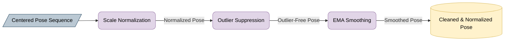

## Module 2: Temporal Alignment (Pelvis Trajectory Extraction)

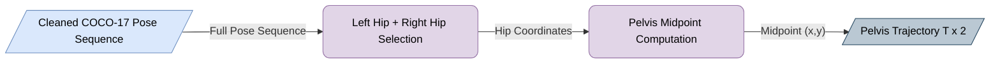

## Module 2: Dynamic Time Warping (DTW)

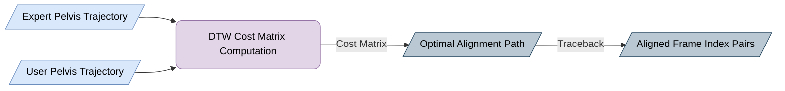

## Module 2: Aligned Pose Generation

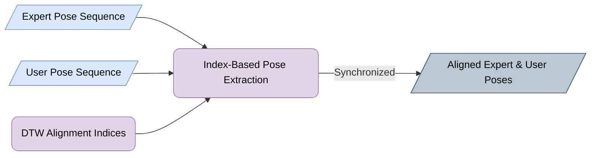

## Module 3: Error Computation Engine

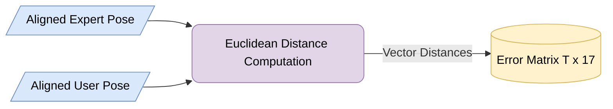

## Module 3: Error Aggregation & Statistics

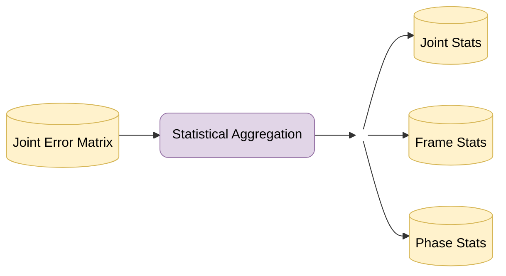

## Module 3: Data Serialization

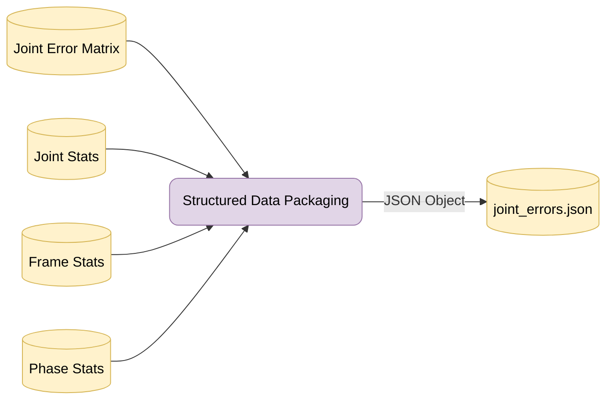

## Module 4: Similarity Scoring Engine

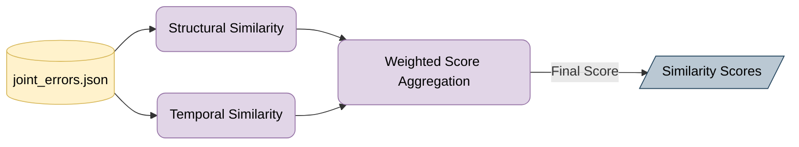
