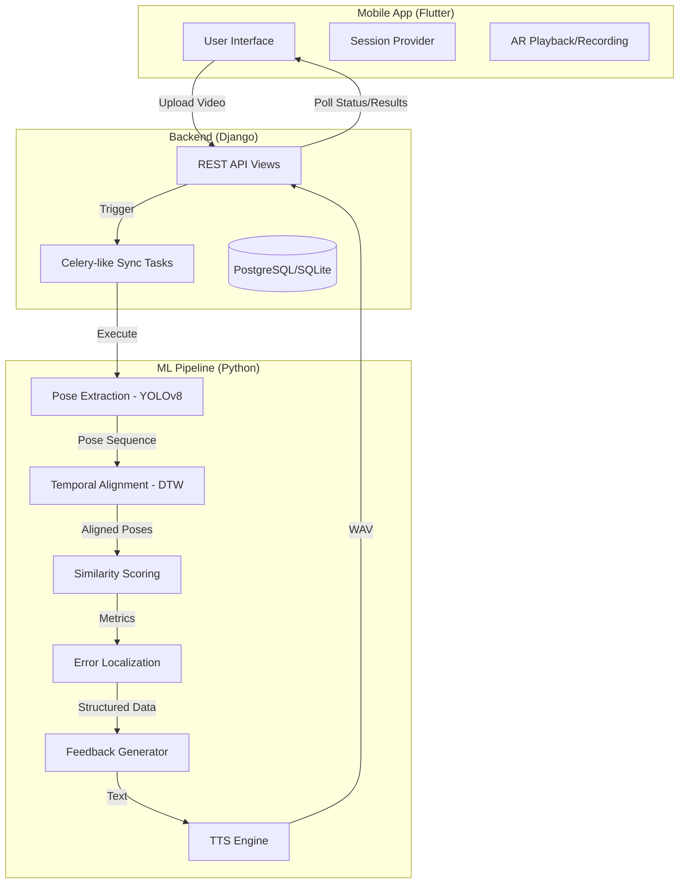

# alysis & Context Transfer Report: Kabaddi Ghost Trainer

This document serves as a comprehensive technical handover for AI agents or developers taking over the Kabaddi Ghost Trainer project. It outlines the current architecture, technical debt, and pending critical fixes.

## 1. Project Vision
An AR-based sports training application that compares a user's live performance of Kabaddi techniques (e.g., hand touch, toe touch) against professionally recorded expert "ghost" data. The system provides multi-level analytical feedback, including spatial accuracy, temporal synchronization, and LLM-driven coaching.

---

## 2. System Architecture

---

## 3. Technical Stack & Key Files

### Mobile (Flutter)
- **State Management**: `Provider` (specifically `SessionProvider`).
- **Networking**: `Dio` for multipart uploads and REST.
- **Audio**: `audioplayers` for TTS feedback.
- **Critical Files**:
    - `lib/providers/session_provider.dart`: Manages the end-to-end lifecycle (Upload -> Poll -> Result).
    - `lib/screens/results_screen.dart`: Renders scores and handles TTS playback with JSON fallback logic.
    - `lib/models/assessment_result.dart`: Maps backend JSON to Dart objects.

### Backend (Django)
- **Task Runner**: Uses `subprocess.run` to call external ML scripts using the project's Virtual Environment (`venv`).
- **Storage**: Media root stores `raw_videos/`, `poses/` (.npy), `expert_poses/`, and `results/` (JSON/WAV).
- **Critical Files**:
    - `api/tasks.py`: Orchestrates the 4-level pipeline including video preprocessing (slowing to 50%).
    - `api/views.py`: API endpoints for status polling and result retrieval.
    - `settings.py`: Defines `PYTHON_EXEC` for venv isolation and `EXTRACT_POSE_SCRIPT` paths.

### ML Pipeline (Python)
- **Pose Format**: COCO-17 (17 keypoints, (x, y) coordinates).
- **Critical Files**:
    - `run_pipeline.py`: The main entry point for analysis. Contains a `clean_nan_pose` fix for undetected facial joints.
    - `pose_validation_metrics.py`: Computes Structural and Temporal similarity.
    - `temporal_alignment.py`: Uses Dynamic Time Warping (DTW) on pelvis trajectories.
    - `tts_engine.py`: Uses `pyttsx3` for offline audio generation.

---

## 4. Critical "Context Transfer" Knowledge

> [!IMPORTANT]
> **Video Speed Mismatch**: Expert reference data was extracted from videos slowed down by 50%. The current pipeline in `api/tasks.py` now uses `ffmpeg` (`setpts=2.0*PTS`) to slow down user videos to match the expert's temporal domain before pose extraction.

> [!WARNING]
> **Coordinate Normalization**: Currently, the system suffers from "distance-noise". If the user is further from the camera than the expert, raw Euclidean distances (DTW) explode, leading to 0% Temporal scores and low overall scores (~12/100). **Next Agent MUST implement spatial normalization (torso-height scaling) before alignment.**

---

## 5. Development Status

| Feature / Fix | Status | Notes |
| :--- | :--- | :--- |
| **Video Upload & DB** | ✅ Done | Stable multipart upload and session tracking. |
| **Pose Extraction** | ✅ Done | Uses YOLOv8. Re-encoded user videos are now 50% slower. |
| **NaN Cleaning** | ✅ Done | Fixed bug where undetected face joints destroyed scores. |
| **Structural Scoring** | ⚠️ Bugged | Functional but requires spatial normalization for accuracy. |
| **Temporal Scoring** | ❌ Bugged | Currently returning 0% due to raw coordinate mismatch in DTW. |
| **LLM Feedback** | ✅ Done | Reasons over Level-3 error metrics (joint-specific errors). |
| **Audio Feedback** | ⚠️ Incomplete | App hits endpoint, but `api/tasks.py` doesn't call `TTSEngine` yet. |
| **AR Playback** | 🛠 To-Do | Ghost AR playback in Flutter needs verification. |

---

## 6. Pending Roadmap (High Priority)

1.  **Spatial Normalization**: Modify `run_pipeline.py` to call `PoseValidationMetrics.normalize_by_torso` on both poses *before* alignment and scoring.
2.  **Audio Generation**: Update `process_multi_level_pipeline` in `api/tasks.py` to instantiate `TTSEngine` and save `feedback.wav` to the session results directory.
3.  **Alignment Optimization**: Flatten the poses to `(T, 34)` and subtract the pelvis (centering) before DTW to make it translation-invariant.
4.  **Flutter UX**: Improve the `ResultsScreen` to show a "Scaling Data..." status if normalization takes extra time.
