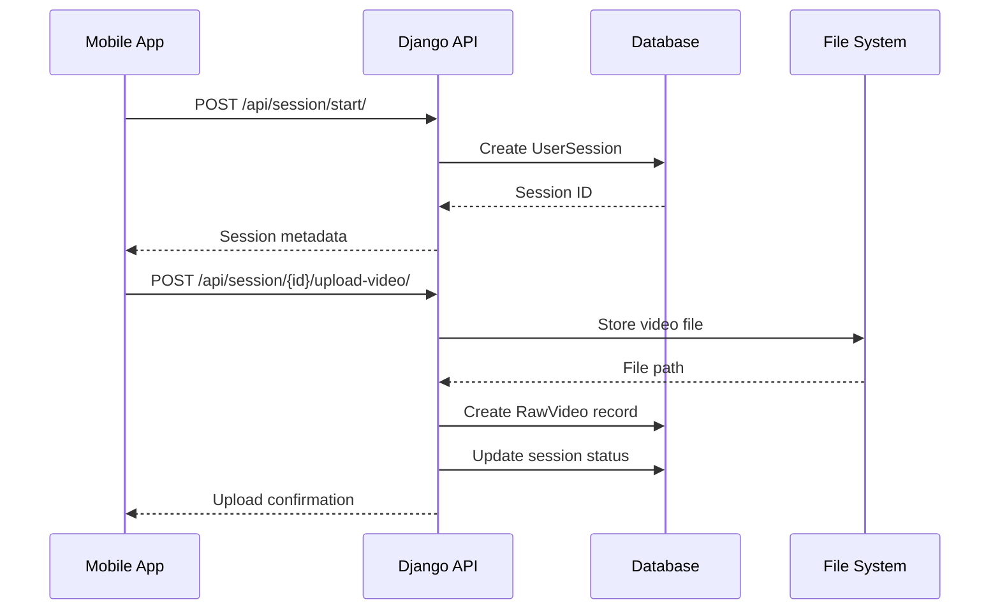
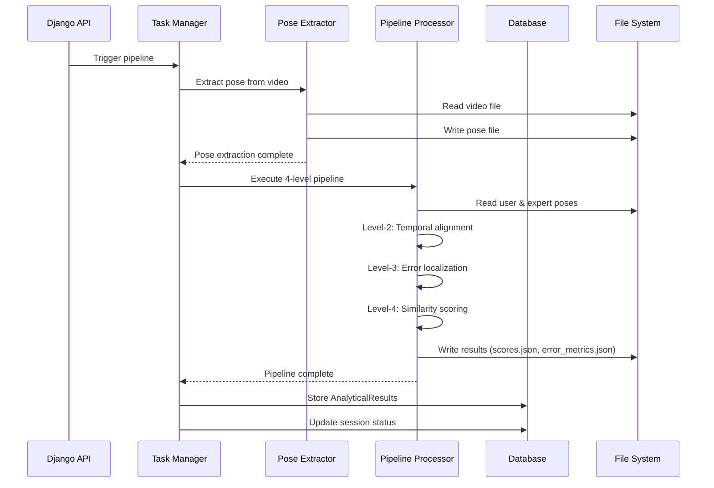
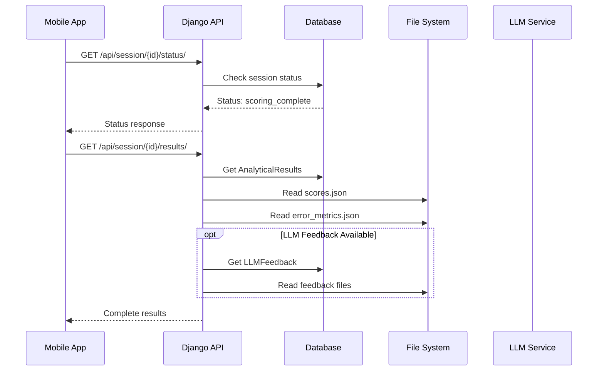

# Technical Architecture Specification - AR-Based Kabaddi Ghost Trainer

## Document Information
- **Version**: 1.0
- **Date**: 2024-01-15
- **Author**: System Architecture Team
- **Classification**: Technical Specification

---

## Table of Contents

1. [System Architecture Overview](#system-architecture-overview)
2. [Component Interaction Diagrams](#component-interaction-diagrams)
3. [Data Flow Specifications](#data-flow-specifications)
4. [Interface Specifications](#interface-specifications)
5. [Algorithm Specifications](#algorithm-specifications)
6. [Performance Requirements](#performance-requirements)
7. [Security Architecture](#security-architecture)
8. [Scalability Design](#scalability-design)

---

## 1. System Architecture Overview

### 1.1 Architectural Patterns

**Pattern**: Layered Architecture with Pipeline Processing
```
┌─────────────────────────────────────────────────────────────┐
│                    Presentation Layer                        │
│  ┌─────────────────┐    ┌─────────────────┐                │
│  │   Mobile App    │    │   Web Client    │                │
│  │   (Unity AR)    │    │   (Optional)    │                │
│  └─────────────────┘    └─────────────────┘                │
└─────────────────────────────────────────────────────────────┘
┌─────────────────────────────────────────────────────────────┐
│                    API Gateway Layer                        │
│  ┌─────────────────────────────────────────────────────────┐ │
│  │              Django REST API                            │ │
│  │  ┌─────────────┐ ┌─────────────┐ ┌─────────────┐      │ │
│  │  │ Tutorial    │ │ Session     │ │ Results     │      │ │
│  │  │ Endpoints   │ │ Management  │ │ Delivery    │      │ │
│  │  └─────────────┘ └─────────────┘ └─────────────┘      │ │
│  └─────────────────────────────────────────────────────────┘ │
└─────────────────────────────────────────────────────────────┘
┌─────────────────────────────────────────────────────────────┐
│                   Business Logic Layer                      │
│  ┌─────────────────────────────────────────────────────────┐ │
│  │              Pipeline Orchestrator                      │ │
│  │  ┌─────────────┐ ┌─────────────┐ ┌─────────────┐      │ │
│  │  │ Async Task  │ │ File        │ │ Status      │      │ │
│  │  │ Manager     │ │ Manager     │ │ Tracker     │      │ │
│  │  └─────────────┘ └─────────────┘ └─────────────┘      │ │
│  └─────────────────────────────────────────────────────────┘ │
└─────────────────────────────────────────────────────────────┘
┌─────────────────────────────────────────────────────────────┐
│                   Processing Layer                          │
│  ┌─────────────────────────────────────────────────────────┐ │
│  │              4-Level Pipeline Engine                    │ │
│  │  ┌─────────────┐ ┌─────────────┐ ┌─────────────┐      │ │
│  │  │ Level-1     │ │ Level-2     │ │ Level-3     │      │ │
│  │  │ Cleaning    │ │ Alignment   │ │ Error Loc   │      │ │
│  │  └─────────────┘ └─────────────┘ └─────────────┘      │ │
│  │  ┌─────────────┐ ┌─────────────┐                      │ │
│  │  │ Level-4     │ │ LLM         │                      │ │
│  │  │ Scoring     │ │ Feedback    │                      │ │
│  │  └─────────────┘ └─────────────┘                      │ │
│  └─────────────────────────────────────────────────────────┘ │
└─────────────────────────────────────────────────────────────┘
┌─────────────────────────────────────────────────────────────┐
│                    Data Layer                               │
│  ┌─────────────────┐ ┌─────────────────┐ ┌─────────────────┐ │
│  │   Database      │ │   File System   │ │   Cache Layer   │ │
│  │   (SQLite/      │ │   (Media Files) │ │   (Optional)    │ │
│  │   PostgreSQL)   │ │                 │ │                 │ │
│  └─────────────────┘ └─────────────────┘ └─────────────────┘ │
└─────────────────────────────────────────────────────────────┘
```

### 1.2 Component Responsibilities

**Presentation Layer**:
- Mobile App: AR visualization, video recording, user interaction
- Web Client: Optional web interface for monitoring/administration

**API Gateway Layer**:
- Request routing and validation
- Authentication and authorization
- Rate limiting and throttling
- Response formatting

**Business Logic Layer**:
- Session lifecycle management
- File upload/download orchestration
- Pipeline execution coordination
- Status tracking and notifications

**Processing Layer**:
- Pose extraction and cleaning
- Temporal alignment algorithms
- Error localization computation
- Similarity scoring
- LLM feedback generation

**Data Layer**:
- Persistent data storage
- File system management
- Caching for performance

### 1.3 Technology Stack Mapping

```
Layer               | Technologies                    | Purpose
--------------------|--------------------------------|---------------------------
Presentation        | Unity, AR Foundation, C#       | Mobile AR experience
API Gateway         | Django, Django REST Framework  | HTTP API endpoints
Business Logic      | Python, Celery (optional)      | Orchestration & workflows
Processing          | NumPy, OpenCV, MediaPipe       | Computer vision & ML
Data Storage        | SQLite/PostgreSQL, FileSystem  | Persistence & media
Infrastructure      | Docker, Nginx, Redis           | Deployment & scaling
```

---

## 2. Component Interaction Diagrams

### 2.1 Session Creation Flow



### 2.2 Pipeline Execution Flow



### 2.3 Results Retrieval Flow



---

## 3. Data Flow Specifications

### 3.1 Pose Data Pipeline

```
Raw Video (MP4)
    ↓ [Pose Extraction]
MediaPipe 33-joint poses (T, 33, 2)
    ↓ [Format Conversion]
COCO-17 poses (T, 17, 2)
    ↓ [Level-1 Cleaning]
Cleaned poses (T, 17, 2)
    ↓ [Level-2 Alignment]
Aligned user & expert poses
    ↓ [Level-3 Error Analysis]
Error metrics (frame-wise, joint-wise)
    ↓ [Level-4 Scoring]
Similarity scores (structural, temporal, overall)
    ↓ [LLM Processing]
Natural language feedback
```

### 3.2 Data Format Specifications

**COCO-17 Joint Order**:
```python
JOINT_NAMES = [
    "nose",           # 0
    "left_eye",       # 1
    "right_eye",      # 2
    "left_ear",       # 3
    "right_ear",      # 4
    "left_shoulder",  # 5
    "right_shoulder", # 6
    "left_elbow",     # 7
    "right_elbow",    # 8
    "left_wrist",     # 9
    "right_wrist",    # 10
    "left_hip",       # 11
    "right_hip",      # 12
    "left_knee",      # 13
    "right_knee",     # 14
    "left_ankle",     # 15
    "right_ankle"     # 16
]
```

**Pose Array Format**:
```python
# Shape: (T, 17, 2)
# T = number of frames
# 17 = COCO-17 joints
# 2 = (x, y) coordinates
pose_array = np.array([
    [  # Frame 0
        [x0, y0],  # nose
        [x1, y1],  # left_eye
        # ... 15 more joints
    ],
    [  # Frame 1
        [x0, y0],  # nose
        [x1, y1],  # left_eye
        # ... 15 more joints
    ],
    # ... T-1 more frames
])
```

### 3.3 File System Organization

```
media/
├── raw_videos/           # Original uploaded videos
│   └── {session_uuid}.mp4
├── poses/               # Extracted pose sequences
│   └── {session_uuid}.npy
├── expert_poses/        # Reference trainer poses
│   ├── hand_touch.npy
│   ├── toe_touch.npy
│   └── bonus.npy
└── results/            # Pipeline outputs
    └── {session_uuid}/
        ├── scores.json          # Level-4 similarity scores
        ├── error_metrics.json   # Level-3 error localization
        ├── feedback.json        # LLM feedback (structured)
        ├── feedback.txt         # LLM feedback (readable)
        └── comparison.mp4       # AR visualization (optional)
```

---

## 4. Interface Specifications

### 4.1 REST API Specification

**Base URL**: `https://api.kabaddi-trainer.com/api/`

**Authentication**: Bearer token (future implementation)

**Content-Type**: `application/json` (except file uploads)

#### 4.1.1 Tutorial Endpoints

**GET /tutorials/**
```json
Response: {
  "tutorials": [
    {
      "id": "uuid",
      "name": "hand_touch",
      "description": "Hand touch kabaddi movement"
    }
  ]
}
```

**GET /tutorials/{tutorial_id}/ar-poses/**
```json
Response: {
  "tutorial_id": "uuid",
  "tutorial_name": "hand_touch",
  "total_frames": 150,
  "duration": 5.0,
  "fps": 30,
  "pose_format": "COCO-17",
  "ar_poses": [
    {
      "frame": 0,
      "timestamp": 0.0,
      "joints": [
        {
          "name": "nose",
          "x": 0.5,
          "y": 0.3,
          "z": 0.0,
          "confidence": 1.0
        }
      ]
    }
  ]
}
```

#### 4.1.2 Session Management Endpoints

**POST /session/start/**
```json
Request: {
  "tutorial_id": "uuid"
}

Response: {
  "session_id": "uuid",
  "tutorial": "hand_touch",
  "status": "created"
}
```

**POST /session/{session_id}/upload-video/**
```
Content-Type: multipart/form-data
Field: video (file)

Response: {
  "session_id": "uuid",
  "status": "video_uploaded",
  "file_size": 15728640
}
```

**POST /session/{session_id}/assess/**
```json
Response: {
  "session_id": "uuid",
  "status": "processing",
  "message": "Multi-level analytical pipeline started"
}
```

**GET /session/{session_id}/status/**
```json
Response: {
  "session_id": "uuid",
  "status": "feedback_generated",
  "updated_at": "2024-01-15T10:30:45.123456Z",
  "error_message": null
}
```

**GET /session/{session_id}/results/**
```json
Response: {
  "session_id": "uuid",
  "tutorial": "hand_touch",
  "scores": {
    "structural": 85.2,
    "temporal": 78.9,
    "overall": 82.1
  },
  "error_metrics": {
    "frame_errors": {
      "shape": [150, 17],
      "data": [[0.12, 0.08, ...], ...]
    },
    "joint_aggregates": {
      "left_shoulder": {
        "mean": 0.15,
        "max": 0.45,
        "std": 0.12
      }
    },
    "temporal_phases": {
      "early": {"left_shoulder": 0.12},
      "mid": {"left_shoulder": 0.18},
      "late": {"left_shoulder": 0.16}
    }
  },
  "feedback": {
    "text": "Based on your hand_touch attempt...",
    "audio_path": null,
    "generated_at": "2024-01-15T10:30:50.123456Z"
  },
  "completed_at": "2024-01-15T10:30:45.123456Z"
}
```

### 4.2 Database Schema Specification

#### 4.2.1 Entity Relationship Diagram

```
Tutorial (1) ──────── (N) UserSession (1) ──────── (1) RawVideo
    │                        │                           
    │                        ├── (1) PoseArtifact       
    │                        ├── (1) AnalyticalResults  
    │                        └── (1) LLMFeedback        
    │
    └── expert_pose_path (file reference)
```

#### 4.2.2 Table Specifications

**tutorials**
```sql
CREATE TABLE tutorials (
    id UUID PRIMARY KEY DEFAULT gen_random_uuid(),
    name VARCHAR(50) UNIQUE NOT NULL,
    description TEXT NOT NULL,
    expert_pose_path VARCHAR(255) NOT NULL,
    is_active BOOLEAN DEFAULT TRUE,
    created_at TIMESTAMP DEFAULT CURRENT_TIMESTAMP
);
```

**user_sessions**
```sql
CREATE TABLE user_sessions (
    id UUID PRIMARY KEY DEFAULT gen_random_uuid(),
    tutorial_id UUID REFERENCES tutorials(id) ON DELETE CASCADE,
    status VARCHAR(20) DEFAULT 'created',
    created_at TIMESTAMP DEFAULT CURRENT_TIMESTAMP,
    updated_at TIMESTAMP DEFAULT CURRENT_TIMESTAMP,
    error_message TEXT
);
```

**raw_videos**
```sql
CREATE TABLE raw_videos (
    id UUID PRIMARY KEY DEFAULT gen_random_uuid(),
    user_session_id UUID UNIQUE REFERENCES user_sessions(id) ON DELETE CASCADE,
    file_path VARCHAR(255) NOT NULL,
    file_size BIGINT NOT NULL,
    uploaded_at TIMESTAMP DEFAULT CURRENT_TIMESTAMP,
    checksum VARCHAR(64)
);
```

**pose_artifacts**
```sql
CREATE TABLE pose_artifacts (
    id UUID PRIMARY KEY DEFAULT gen_random_uuid(),
    user_session_id UUID UNIQUE REFERENCES user_sessions(id) ON DELETE CASCADE,
    pose_level1_path VARCHAR(255) NOT NULL,
    generated_at TIMESTAMP DEFAULT CURRENT_TIMESTAMP
);
```

**analytical_results**
```sql
CREATE TABLE analytical_results (
    id UUID PRIMARY KEY DEFAULT gen_random_uuid(),
    user_session_id UUID UNIQUE REFERENCES user_sessions(id) ON DELETE CASCADE,
    scores_json_path VARCHAR(255) NOT NULL,
    error_metrics_json_path VARCHAR(255) NOT NULL,
    alignment_indices_path VARCHAR(255),
    completed_at TIMESTAMP DEFAULT CURRENT_TIMESTAMP
);
```

**llm_feedback**
```sql
CREATE TABLE llm_feedback (
    id UUID PRIMARY KEY DEFAULT gen_random_uuid(),
    user_session_id UUID UNIQUE REFERENCES user_sessions(id) ON DELETE CASCADE,
    feedback_text TEXT NOT NULL,
    audio_feedback_path VARCHAR(255),
    generated_at TIMESTAMP DEFAULT CURRENT_TIMESTAMP,
    llm_model_used VARCHAR(100) DEFAULT 'gpt-4'
);
```

---

## 5. Algorithm Specifications

### 5.1 Level-2 Temporal Alignment (DTW)

**Algorithm**: Dynamic Time Warping on Pelvis Trajectories

**Input**: 
- User poses: (T_user, 17, 2)
- Expert poses: (T_expert, 17, 2)

**Output**: 
- Alignment indices: (user_indices, expert_indices)

**Complexity**: O(T_user × T_expert)

**Implementation**:
```python
def temporal_alignment(user_poses, expert_poses):
    # Extract pelvis trajectories (hip midpoint)
    user_pelvis = (user_poses[:, 11, :] + user_poses[:, 12, :]) / 2.0
    expert_pelvis = (expert_poses[:, 11, :] + expert_poses[:, 12, :]) / 2.0
    
    # Compute distance matrix
    T_user, T_expert = len(user_pelvis), len(expert_pelvis)
    distances = np.zeros((T_user, T_expert))
    
    for i in range(T_user):
        for j in range(T_expert):
            diff = user_pelvis[i] - expert_pelvis[j]
            distances[i, j] = np.sqrt(np.sum(diff ** 2))
    
    # DTW dynamic programming
    dtw_matrix = np.full((T_user, T_expert), np.inf)
    dtw_matrix[0, 0] = distances[0, 0]
    
    # Fill first row and column
    for i in range(1, T_user):
        dtw_matrix[i, 0] = dtw_matrix[i-1, 0] + distances[i, 0]
    for j in range(1, T_expert):
        dtw_matrix[0, j] = dtw_matrix[0, j-1] + distances[0, j]
    
    # Fill DTW matrix
    for i in range(1, T_user):
        for j in range(1, T_expert):
            cost = distances[i, j]
            dtw_matrix[i, j] = cost + min(
                dtw_matrix[i-1, j],     # insertion
                dtw_matrix[i, j-1],     # deletion
                dtw_matrix[i-1, j-1]    # match
            )
    
    # Backtrack to find optimal path
    path = []
    i, j = T_user - 1, T_expert - 1
    
    while i > 0 or j > 0:
        path.append((i, j))
        
        if i == 0:
            j -= 1
        elif j == 0:
            i -= 1
        else:
            costs = [
                dtw_matrix[i-1, j-1],  # diagonal
                dtw_matrix[i-1, j],    # up
                dtw_matrix[i, j-1]     # left
            ]
            min_idx = np.argmin(costs)
            
            if min_idx == 0:    # diagonal
                i, j = i-1, j-1
            elif min_idx == 1:  # up
                i -= 1
            else:               # left
                j -= 1
    
    path.append((0, 0))
    path.reverse()
    
    # Extract indices
    user_indices = [pair[0] for pair in path]
    expert_indices = [pair[1] for pair in path]
    
    return user_indices, expert_indices
```

### 5.2 Level-3 Error Localization

**Algorithm**: Frame-wise Euclidean Distance with Statistical Aggregation

**Input**: 
- Aligned user poses: (T, 17, 2)
- Aligned expert poses: (T, 17, 2)

**Output**: 
- Frame errors: (T, 17) matrix
- Joint aggregates: mean, max, std per joint
- Temporal phases: early, mid, late phase errors

**Implementation**:
```python
def compute_error_metrics(aligned_user_poses, aligned_trainer_poses):
    # Compute frame-wise Euclidean error per joint
    frame_errors = np.linalg.norm(
        aligned_user_poses - aligned_trainer_poses, axis=2
    )  # Shape: (T, 17)
    
    # Aggregate joint-wise statistics
    joint_aggregates = {}
    for j, joint_name in enumerate(COCO_17_JOINTS):
        joint_errors = frame_errors[:, j]
        joint_aggregates[joint_name] = {
            "mean": float(np.mean(joint_errors)),
            "max": float(np.max(joint_errors)),
            "std": float(np.std(joint_errors))
        }
    
    # Temporal phase segmentation
    T = frame_errors.shape[0]
    phase_boundaries = [0, T//3, 2*T//3, T]
    phases = ["early", "mid", "late"]
    
    temporal_phases = {}
    for i, phase in enumerate(phases):
        start_idx = phase_boundaries[i]
        end_idx = phase_boundaries[i + 1]
        phase_errors = frame_errors[start_idx:end_idx]
        
        phase_joint_means = {}
        for j, joint_name in enumerate(COCO_17_JOINTS):
            phase_joint_means[joint_name] = float(np.mean(phase_errors[:, j]))
        
        temporal_phases[phase] = phase_joint_means
    
    return {
        "frame_errors": {
            "shape": list(frame_errors.shape),
            "data": frame_errors.tolist()
        },
        "joint_aggregates": joint_aggregates,
        "temporal_phases": temporal_phases,
        "metadata": {
            "total_frames": T,
            "joints_count": 17,
            "phase_boundaries": phase_boundaries
        }
    }
```

### 5.3 Level-4 Similarity Scoring

**Algorithm**: Multi-component Similarity Assessment

**Components**:
1. **Structural Similarity**: Joint position accuracy
2. **Temporal Similarity**: Motion timing consistency
3. **Overall Score**: Weighted combination

**Implementation**:
```python
def compute_similarity_scores(aligned_user_poses, aligned_expert_poses):
    # Structural similarity (position accuracy)
    position_errors = np.linalg.norm(
        aligned_user_poses - aligned_expert_poses, axis=2
    )
    mean_position_error = np.mean(position_errors)
    
    # Normalize to 0-100 scale (lower error = higher score)
    max_error_threshold = 50.0  # pixels
    structural_score = max(0, 100 * (1 - mean_position_error / max_error_threshold))
    
    # Temporal similarity (motion consistency)
    user_velocities = np.diff(aligned_user_poses, axis=0)
    expert_velocities = np.diff(aligned_expert_poses, axis=0)
    
    velocity_errors = np.linalg.norm(user_velocities - expert_velocities, axis=2)
    mean_velocity_error = np.mean(velocity_errors)
    
    max_velocity_threshold = 20.0  # pixels/frame
    temporal_score = max(0, 100 * (1 - mean_velocity_error / max_velocity_threshold))
    
    # Overall score (weighted combination)
    overall_score = 0.6 * structural_score + 0.4 * temporal_score
    
    return {
        "structural": float(structural_score),
        "temporal": float(temporal_score),
        "overall": float(overall_score)
    }
```

---

## 6. Performance Requirements

### 6.1 Response Time Requirements

| Operation | Target Response Time | Maximum Acceptable |
|-----------|---------------------|-------------------|
| Tutorial List | < 200ms | 500ms |
| Session Creation | < 300ms | 1s |
| Video Upload (50MB) | < 30s | 60s |
| Pipeline Trigger | < 500ms | 2s |
| Status Check | < 100ms | 300ms |
| Results Retrieval | < 1s | 3s |

### 6.2 Processing Time Requirements

| Pipeline Stage | Target Time | Maximum Acceptable |
|---------------|-------------|-------------------|
| Pose Extraction | < 2min | 5min |
| Level-1 Cleaning | < 10s | 30s |
| Level-2 Alignment | < 5s | 15s |
| Level-3 Error Analysis | < 3s | 10s |
| Level-4 Scoring | < 2s | 5s |
| LLM Feedback | < 30s | 60s |
| **Total Pipeline** | < 3min | 7min |

### 6.3 Throughput Requirements

| Metric | Target | Peak Capacity |
|--------|--------|---------------|
| Concurrent Sessions | 50 | 100 |
| Video Uploads/hour | 200 | 500 |
| Pipeline Executions/hour | 100 | 200 |
| API Requests/second | 100 | 500 |

### 6.4 Resource Requirements

**Minimum System Requirements**:
- CPU: 4 cores, 2.5 GHz
- RAM: 8 GB
- Storage: 100 GB SSD
- Network: 100 Mbps

**Recommended System Requirements**:
- CPU: 8 cores, 3.0 GHz
- RAM: 16 GB
- Storage: 500 GB SSD
- Network: 1 Gbps
- GPU: Optional (for pose estimation acceleration)

---

## 7. Security Architecture

### 7.1 Security Layers

```
┌─────────────────────────────────────────────────────────────┐
│                    Network Security                         │
│  • HTTPS/TLS 1.3                                          │
│  • Firewall rules                                         │
│  • DDoS protection                                        │
└─────────────────────────────────────────────────────────────┘
┌─────────────────────────────────────────────────────────────┐
│                 Application Security                        │
│  • API authentication                                      │
│  • Input validation                                        │
│  • CSRF protection                                         │
│  • Rate limiting                                           │
└─────────────────────────────────────────────────────────────┘
┌─────────────────────────────────────────────────────────────┐
│                    Data Security                            │
│  • UUID-based identifiers                                  │
│  • File access controls                                    │
│  • Database encryption                                     │
│  • Secure file storage                                     │
└─────────────────────────────────────────────────────────────┘
```

### 7.2 Authentication & Authorization

**Current Implementation**: No authentication (development)

**Production Requirements**:
```python
# API Key Authentication
class APIKeyAuthentication:
    def authenticate(self, request):
        api_key = request.headers.get('X-API-Key')
        if not api_key:
            return None
        
        try:
            user = User.objects.get(api_key=api_key, is_active=True)
            return (user, None)
        except User.DoesNotExist:
            raise AuthenticationFailed('Invalid API key')

# Rate Limiting
@ratelimit(key='ip', rate='100/h', method='POST')
def upload_video(request):
    # Implementation
    pass
```

### 7.3 Data Protection

**File Security**:
- UUID-based file naming (prevents enumeration)
- Directory traversal protection
- File type validation
- Size limits enforcement

**Database Security**:
- Parameterized queries (SQL injection prevention)
- UUID primary keys (prevents enumeration)
- Cascade deletion (data consistency)
- Connection encryption

**Privacy Considerations**:
- No PII storage in pose data
- Video files stored with UUID names
- Automatic cleanup policies (future)
- GDPR compliance ready

---

## 8. Scalability Design

### 8.1 Horizontal Scaling Strategy

```
┌─────────────────────────────────────────────────────────────┐
│                    Load Balancer                            │
│                   (Nginx/HAProxy)                           │
└─────────────────────────────────────────────────────────────┘
         │                    │                    │
┌─────────────────┐  ┌─────────────────┐  ┌─────────────────┐
│   Django App    │  │   Django App    │  │   Django App    │
│   Instance 1    │  │   Instance 2    │  │   Instance N    │
└─────────────────┘  └─────────────────┘  └─────────────────┘
         │                    │                    │
         └────────────────────┼────────────────────┘
                              │
┌─────────────────────────────────────────────────────────────┐
│                 Shared Resources                            │
│  ┌─────────────────┐  ┌─────────────────┐  ┌─────────────┐ │
│  │   Database      │  │   File System   │  │   Cache     │ │
│  │  (PostgreSQL)   │  │   (NFS/S3)      │  │  (Redis)    │ │
│  └─────────────────┘  └─────────────────┘  └─────────────┘ │
└─────────────────────────────────────────────────────────────┘
```

### 8.2 Pipeline Scaling

**Async Processing with Celery**:
```python
# Celery configuration
CELERY_BROKER_URL = 'redis://localhost:6379/0'
CELERY_RESULT_BACKEND = 'redis://localhost:6379/0'

# Task distribution
@celery_app.task
def process_multi_level_pipeline(session_id):
    # Pipeline implementation
    pass

# Worker scaling
# celery -A kabaddi_backend worker --loglevel=info --concurrency=4
```

**Resource Isolation**:
- CPU-intensive tasks: Dedicated worker nodes
- I/O-intensive tasks: Separate worker pool
- GPU acceleration: Specialized nodes for pose estimation

### 8.3 Storage Scaling

**File System Strategy**:
```python
# Distributed file storage
MEDIA_STORAGE_BACKENDS = {
    'local': 'django.core.files.storage.FileSystemStorage',
    's3': 'storages.backends.s3boto3.S3Boto3Storage',
    'gcs': 'storages.backends.gcloud.GoogleCloudStorage'
}

# Automatic cleanup
@periodic_task(run_every=crontab(hour=2, minute=0))
def cleanup_old_files():
    cutoff_date = timezone.now() - timedelta(days=30)
    old_sessions = UserSession.objects.filter(
        created_at__lt=cutoff_date,
        status__in=['failed', 'feedback_generated']
    )
    
    for session in old_sessions:
        # Clean up associated files
        cleanup_session_files(session)
        session.delete()
```

### 8.4 Database Scaling

**Read Replicas**:
```python
DATABASE_ROUTERS = ['myapp.routers.DatabaseRouter']

class DatabaseRouter:
    def db_for_read(self, model, **hints):
        if model._meta.app_label == 'api':
            return 'replica'
        return 'default'
    
    def db_for_write(self, model, **hints):
        return 'default'
```

**Partitioning Strategy**:
```sql
-- Partition user_sessions by date
CREATE TABLE user_sessions_2024_01 PARTITION OF user_sessions
FOR VALUES FROM ('2024-01-01') TO ('2024-02-01');

CREATE TABLE user_sessions_2024_02 PARTITION OF user_sessions
FOR VALUES FROM ('2024-02-01') TO ('2024-03-01');
```

---

## 9. Monitoring and Observability

### 9.1 Metrics Collection

**System Metrics**:
- CPU usage, memory usage, disk I/O
- Network throughput, connection counts
- Database query performance
- File system usage

**Application Metrics**:
- API response times, error rates
- Pipeline execution times
- Session success/failure rates
- Queue lengths and processing times

**Business Metrics**:
- Active users, session counts
- Tutorial popularity
- Average scores, improvement trends
- User engagement patterns

### 9.2 Logging Strategy

**Log Levels**:
```python
LOGGING = {
    'version': 1,
    'disable_existing_loggers': False,
    'formatters': {
        'verbose': {
            'format': '{levelname} {asctime} {module} {process:d} {thread:d} {message}',
            'style': '{',
        },
        'json': {
            'format': '{"level": "%(levelname)s", "time": "%(asctime)s", "module": "%(module)s", "message": "%(message)s"}',
        },
    },
    'handlers': {
        'file': {
            'level': 'INFO',
            'class': 'logging.handlers.RotatingFileHandler',
            'filename': '/app/logs/django.log',
            'maxBytes': 1024*1024*15,  # 15MB
            'backupCount': 10,
            'formatter': 'json',
        },
        'console': {
            'level': 'DEBUG',
            'class': 'logging.StreamHandler',
            'formatter': 'verbose',
        },
    },
    'loggers': {
        'api': {
            'handlers': ['file', 'console'],
            'level': 'DEBUG',
            'propagate': False,
        },
        'pipeline': {
            'handlers': ['file', 'console'],
            'level': 'INFO',
            'propagate': False,
        },
    },
}
```

### 9.3 Health Checks

**Endpoint**: `/health/`
```python
def health_check():
    checks = {
        'database': check_database_connection(),
        'filesystem': check_file_system_access(),
        'pipeline_scripts': check_pipeline_scripts(),
        'disk_space': check_disk_space(),
        'memory_usage': check_memory_usage()
    }
    
    overall_status = 'healthy' if all(checks.values()) else 'unhealthy'
    
    return {
        'status': overall_status,
        'timestamp': timezone.now().isoformat(),
        'checks': checks
    }
```

---

## 10. Conclusion

This Technical Architecture Specification provides comprehensive low-level design details for the AR-Based Kabaddi Ghost Trainer system. The architecture emphasizes:

1. **Modularity**: Clear separation of concerns across layers
2. **Scalability**: Horizontal scaling capabilities
3. **Reliability**: Robust error handling and monitoring
4. **Security**: Multi-layered security approach
5. **Performance**: Optimized algorithms and caching strategies
6. **Maintainability**: Well-defined interfaces and documentation

The system is designed to handle the complete user journey from AR tutorial viewing through performance assessment and feedback delivery, with a focus on deterministic, explainable results.

---

**Document Control**:
- Version: 1.0
- Last Updated: 2024-01-15
- Next Review: 2024-04-15
- Approval: System Architecture Team